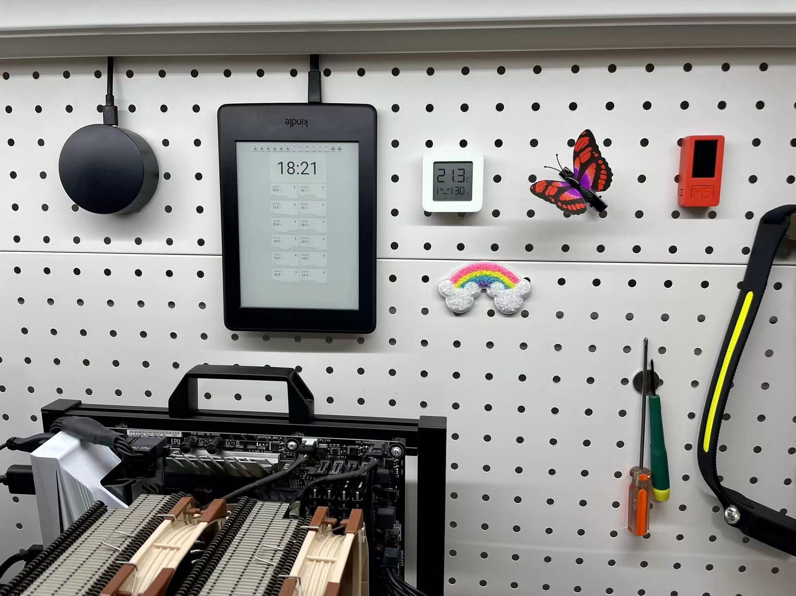
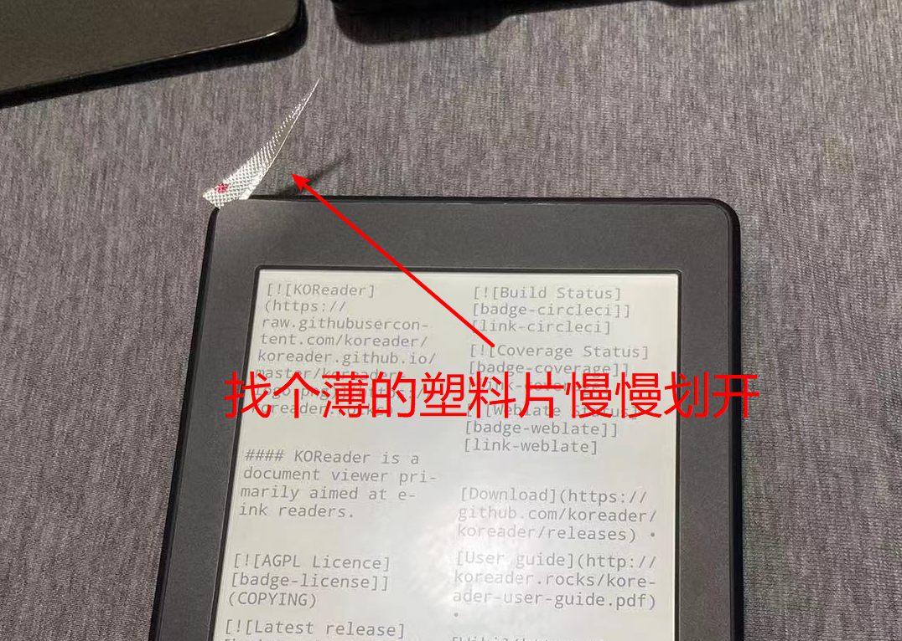
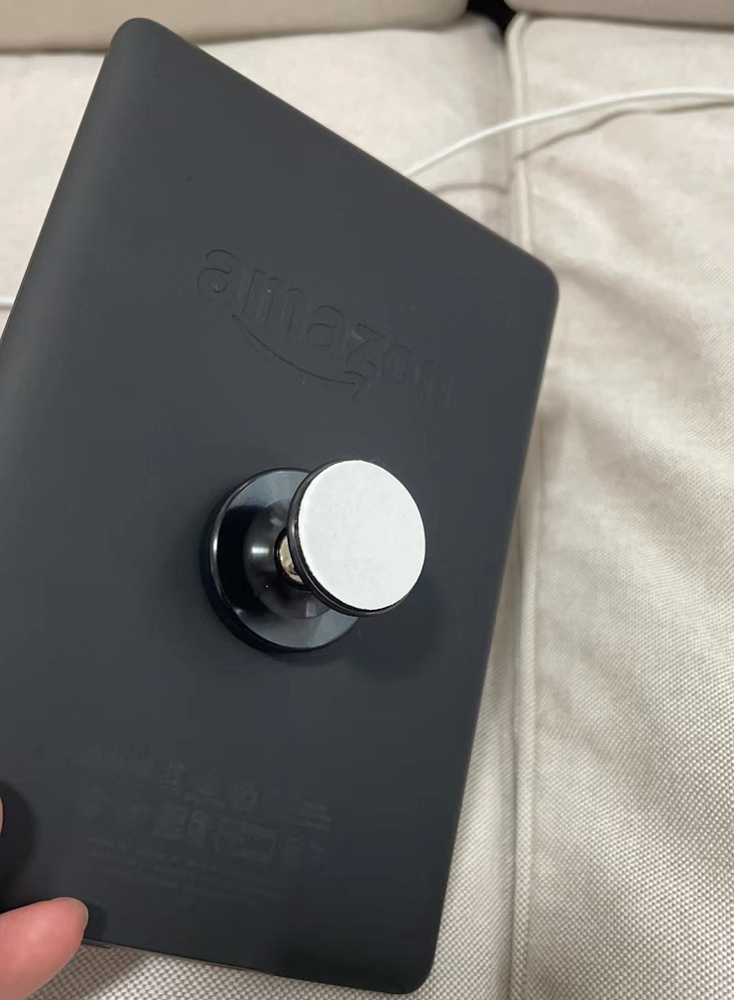
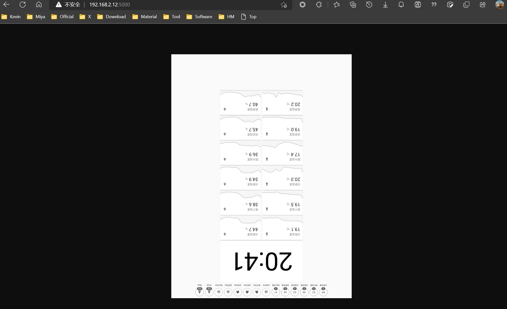

# Kindle



居家隔离`7`天，闲来没事就想起来一直落灰的`Kindle`。如何把它利用起来呢？首先我想到的就是能不能当`HA`的浏览器，显示控制`HA`，很遗憾自带的浏览器连登录都做不到，所以只能找找其他方案。另外一个想法是能不能刷安卓装个浏览器不就好了，可以查了才发现`Kindle`的安卓并没有想象的好，一个是收费贼贵，另外一个看反馈是卡顿严重，所以安卓的我暂时也没试，有兴趣的可以看看这个[帖子](https://community.wvbtech.com/d/3027 
)，已破解收费的安卓。最终选定了这个项目[screensaver](https://github.com/sibbl/hass-lovelace-kindle-screensaver)。这是个基于越狱后安装两个插件实现的项目，原理是把HA的页面生成Kindle锁屏图片替换自带锁屏墙纸

## `越狱`

越狱需要根据自己Kindle的型号和版本确定，可以看看书伴网的[教程](https://bookfere.com/post/406.html)非常详细，根据自己型号和系统版本来。我`Kindle`是`pw3`，固件是最新，所以只能拆机`TTL`越狱。其实拆机我感觉反而简单，因为`TTL`好像是支持任何版本的。主要参考这篇[文章](https://bookfere.com/post/767.html)，非常详细，基本无坑。只是需要动手能力，会焊接，熟悉`Linux`常用知识和命令

书伴网的教程已经非常详细，我加点注意点和改磁吸







## `显示HA页面`

参考这篇[文章](https://cloud.tencent.com/developer/article/1990885)，非常详细。主要注意的是[原screensaver的docker镜像](https://github.com/sibbl/hass-lovelace-kindle-screensaver)并不自持中文我重新打包了加入中文支持的[docker镜像](https://hub.docker.com/r/liwei19920307/screensaver)

以下是我的`docker-compose`配置文件，根据自己实际情况修改

```yml
  screensaver:
    image: liwei19920307/screensaver:latest
    container_name: screensaver
    volumes:
      - /etc/localtime:/etc/localtime:ro
    environment:
      - TZ=Asia/Shanghai
      - HA_BASE_URL=http://192.168.2.12:8123
      - HA_SCREENSHOT_URL=/lovelace/kindle?kiosk
      - HA_ACCESS_TOKEN=替换自己的token
      - CRON_JOB=* * * * *
      - RENDERING_TIMEOUT=10000
      - RENDERING_DELAY=0
      - RENDERING_SCREEN_HEIGHT=1448
      - RENDERING_SCREEN_WIDTH=1072
      - GRAYSCALE_DEPTH=8
      - OUTPUT_PATH=/output/cover.png
      - LANGUAGE=cn
      - ROTATION=180
      - SCALING=1
    network_mode: host
    restart: always
```

部署正常就能打开如下页面，其实就是自己`HA`的一个截图，默认一分钟更新一次




通过`HA`控制`Kindle`锁屏下刷新其实就是`ssh`登录`Kindle`后执行插件脚本
具体我就细说了，每个人`HA`情况不同，需要搞定`HA`能`ssh`登录`Kindle`，这步搞定就没啥了，ssh无线管理安装这个[插件](https://bookfere.com/post/59.html)

## 注意不插充电线锁屏状态`Kindle`的`Wifi`是会断开的，所以要想任何时候都能刷新，需要常电

```
  ssh kindle /mnt/us/extensions/onlinescreensaver/bin/update.sh
```

## `更多玩法`

`Kindle`系统其实就是`Linux`，既然都拿到了`root`权限，写一些脚本控制一些东西就变得比较简单
